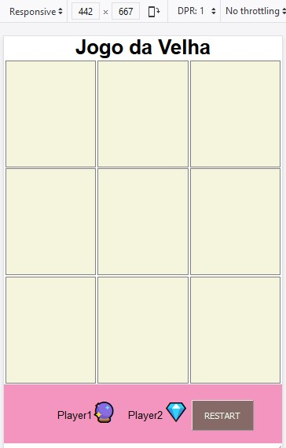
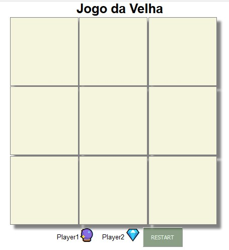

# Projeto
O projeto jogo da velha foi desenvolvido a partir de aulas assistidas do ProgramadorBR.

O jogo foi desenvolvido com a partir de uma tabela com id em cada celula. Foram gerados dois arquivos em Javascript para simular o modelo MVC;

# Imagens da versão mobile e desktop em sequência:

;

;